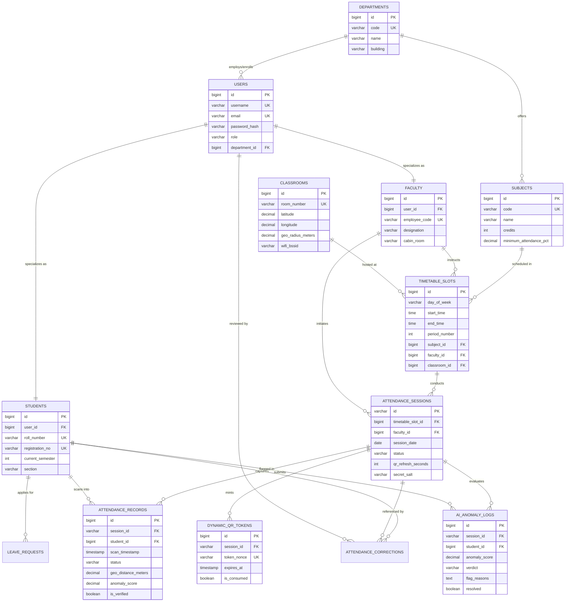

# ATTENDX CAMPUS 2026: Entity-Relationship (ER) Diagram

```mermaid
erDiagram
    DEPARTMENTS ||--o{ USERS : "employs/enrolls"
    DEPARTMENTS ||--o{ SUBJECTS : "offers"
    USERS ||--|| STUDENTS : "specializes as"
    USERS ||--|| FACULTY : "specializes as"
    
    SUBJECTS ||--o{ TIMETABLE_SLOTS : "scheduled in"
    FACULTY ||--o{ TIMETABLE_SLOTS : "instructs"
    CLASSROOMS ||--o{ TIMETABLE_SLOTS : "hosted at"
    
    TIMETABLE_SLOTS ||--o{ ATTENDANCE_SESSIONS : "conducts"
    FACULTY ||--o{ ATTENDANCE_SESSIONS : "initiates"
    
    ATTENDANCE_SESSIONS ||--o{ DYNAMIC_QR_TOKENS : "mints"
    ATTENDANCE_SESSIONS ||--o{ ATTENDANCE_RECORDS : "captures"
    STUDENTS ||--o{ ATTENDANCE_RECORDS : "scans into"
    
    STUDENTS ||--o{ ATTENDANCE_CORRECTIONS : "submits"
    ATTENDANCE_SESSIONS ||--o{ ATTENDANCE_CORRECTIONS : "referenced by"
    USERS ||--o{ ATTENDANCE_CORRECTIONS : "reviewed by"
    
    STUDENTS ||--o{ LEAVE_REQUESTS : "applies for"
    
    ATTENDANCE_SESSIONS ||--o{ AI_ANOMALY_LOGS : "evaluates"
    STUDENTS ||--o{ AI_ANOMALY_LOGS : "flagged in"

    DEPARTMENTS {
        bigint id PK
        varchar code UK
        varchar name
        varchar building
    }

    USERS {
        bigint id PK
        varchar username UK
        varchar email UK
        varchar password_hash
        varchar role
        bigint department_id FK
    }

    STUDENTS {
        bigint id PK
        bigint user_id FK
        varchar roll_number UK
        varchar registration_no UK
        int current_semester
        varchar section
    }

    FACULTY {
        bigint id PK
        bigint user_id FK
        varchar employee_code UK
        varchar designation
        varchar cabin_room
    }

    SUBJECTS {
        bigint id PK
        varchar code UK
        varchar name
        int credits
        decimal minimum_attendance_pct
    }

    CLASSROOMS {
        bigint id PK
        varchar room_number UK
        decimal latitude
        decimal longitude
        decimal geo_radius_meters
        varchar wifi_bssid
    }

    TIMETABLE_SLOTS {
        bigint id PK
        varchar day_of_week
        time start_time
        time end_time
        int period_number
        bigint subject_id FK
        bigint faculty_id FK
        bigint classroom_id FK
    }

    ATTENDANCE_SESSIONS {
        varchar id PK
        bigint timetable_slot_id FK
        bigint faculty_id FK
        date session_date
        varchar status
        int qr_refresh_seconds
        varchar secret_salt
    }

    DYNAMIC_QR_TOKENS {
        bigint id PK
        varchar session_id FK
        varchar token_nonce UK
        timestamp expires_at
        boolean is_consumed
    }

    ATTENDANCE_RECORDS {
        bigint id PK
        varchar session_id FK
        bigint student_id FK
        timestamp scan_timestamp
        varchar status
        decimal geo_distance_meters
        decimal anomaly_score
        boolean is_verified
    }

    AI_ANOMALY_LOGS {
        bigint id PK
        varchar session_id FK
        bigint student_id FK
        decimal anomaly_score
        varchar verdict
        text flag_reasons
        boolean resolved
    }
```
